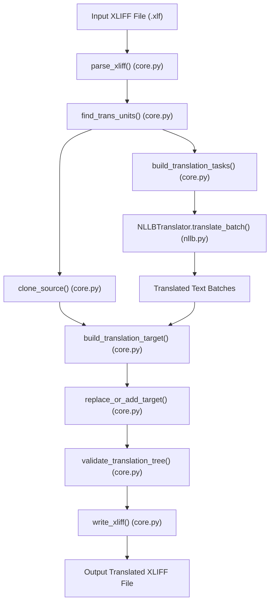

# XLIFF NLLB Translator — Complete Codebase & Architecture Guide

## 1. Executive Summary

**XLIFF NLLB Translator** (`xliff-nllb-translator`) is a Python application designed to translate **XLIFF 1.2** localization documents using Meta's **NLLB (No Language Left Behind)** sequence-to-sequence neural translation models via Hugging Face `transformers` and `torch`.

### Core Design Philosophy
Translating XML files with Machine Translation models usually risks corrupting inline XML markup, tag ordering, element attributes, or XML namespaces. This codebase solves that by decoupling XML structure from textual content:
1. **Source Preservation**: The original `<source>` element within each `<trans-unit>` is never mutated.
2. **Structure Cloning**: `<target>` elements are created as exact structural deep clones of `<source>`.
3. **Leaf Text Extraction**: Text is extracted from XML leaf nodes (handling both `.text` and `.tail` properties).
4. **Decoupled Neural Translation**: Only plain text strings (or strings with synthetic markers) are sent to NLLB.
5. **Exact Target Re-injection**: Translated text strings are injected back into the cloned target tree at exact text node positions, ensuring tags, `<g>` inline elements, IDs, and attributes remain intact.

---

## 2. Directory & Component Overview

```
xliff_translator/
├── Create-functional-architecture.xlf  # Sample input XLIFF document
├── README.md                            # High-level usage guide
├── pyproject.toml                       # Package setup and entry points (xliff-translator CLI)
├── requirements.txt                     # Core dependencies (lxml, transformers, torch, etc.)
├── tests/                               # Pytest suite
│   ├── fixture.xlf                      # Test XLIFF fixture file
│   ├── test_protection.py               # Unit tests for marker generation & validation
│   ├── test_deprotection.py             # Unit tests for stack-based XML target reconstruction
│   └── test_reconstruction.py           # Integrity tests for XML tree cloning & preservation
└── xliff_translator/                    # Core Python package
    ├── __init__.py                      # Package metadata & version
    ├── __main__.py                      # CLI entry point dispatch (`python -m xliff_translator`)
    ├── cli.py                           # Argument parsing and command handlers (`inspect`, `translate`)
    ├── core.py                          # Primary XML parsing, text location extraction & tree manipulation
    ├── protection.py                    # Inline tag protection & marker generation
    ├── deprotection.py                  # Stack-based XML target reconstruction from marked text
    ├── segments.py                      # Alternative segment-based text extraction & marker handling
    ├── nllb.py                          # Hugging Face PyTorch model loader & batched inferencing
    ├── pipeline.py                      # End-to-end orchestration pipeline
    └── web/                             # Web UI application
        ├── __init__.py                  # Web package marker
        ├── app.py                       # FastAPI application & REST API endpoints
        └── static/                      # Static web assets
            ├── index.html               # Frontend HTML UI
            ├── style.css                # Visual design stylesheet
            └── app.js                   # Frontend drag-and-drop & API fetch handler
```

---

## 3. High-Level System Architecture & Flow



---

## 4. File-by-File & Function-by-Function Breakdown

### 4.1 CLI & Entry Points

#### [`xliff_translator/__main__.py`](file:///c:/Users/svc_3dxlabuser/Desktop/xliff_translator/xliff_translator/__main__.py)
- **Role**: Entry point when invoking the package as a module (`python -m xliff_translator`).
- **Calls**: [`main()`](file:///c:/Users/svc_3dxlabuser/Desktop/xliff_translator/xliff_translator/cli.py#L164-L170) from [`cli.py`](file:///c:/Users/svc_3dxlabuser/Desktop/xliff_translator/xliff_translator/cli.py).

#### [`xliff_translator/cli.py`](file:///c:/Users/svc_3dxlabuser/Desktop/xliff_translator/xliff_translator/cli.py)
- **Role**: Parses command-line arguments and dispatches commands.
- **Key Functions**:
  - [`cmd_inspect(args)`](file:///c:/Users/svc_3dxlabuser/Desktop/xliff_translator/xliff_translator/cli.py#L17-L26): Calls [`inspect_xliff()`](file:///c:/Users/svc_3dxlabuser/Desktop/xliff_translator/xliff_translator/core.py#L205-L282) and outputs a human-readable list of trans-units and text leaves.
  - [`cmd_translate(args)`](file:///c:/Users/svc_3dxlabuser/Desktop/xliff_translator/xliff_translator/cli.py#L28-L64): Instantiates [`NLLBTranslator`](file:///c:/Users/svc_3dxlabuser/Desktop/xliff_translator/xliff_translator/nllb.py#L11-L284), maps short language codes (`en`, `fr`, `de`) to NLLB codes (`eng_Latn`, `fra_Latn`, `deu_Latn`), and invokes [`translate_file()`](file:///c:/Users/svc_3dxlabuser/Desktop/xliff_translator/xliff_translator/pipeline.py#L24-L321).
  - [`build_parser()`](file:///c:/Users/svc_3dxlabuser/Desktop/xliff_translator/xliff_translator/cli.py#L67-L161): Defines CLI subparsers (`inspect` and `translate`) and flags (`--langs`, `--model`, `--output-dir`, `--batch-size`).
  - [`main()`](file:///c:/Users/svc_3dxlabuser/Desktop/xliff_translator/xliff_translator/cli.py#L164-L170): Parses `sys.argv` and executes the attached default command function.

---

### 4.2 Core XML Primitive Operations

#### [`xliff_translator/core.py`](file:///c:/Users/svc_3dxlabuser/Desktop/xliff_translator/xliff_translator/core.py)
- **Role**: Fundamental XML tree parser, XPath querying, leaf text traversal, target cloning, and validation.
- **Classes**:
  - [`TranslationTask`](file:///c:/Users/svc_3dxlabuser/Desktop/xliff_translator/xliff_translator/core.py#L13-L30): `@dataclass` holding `unit_index`, `location_index`, and `text` to be translated.
  - [`TextLocation`](file:///c:/Users/svc_3dxlabuser/Desktop/xliff_translator/xliff_translator/core.py#L285-L326): Wraps an XML element and an attribute name (`"text"` or `"tail"`), exposing `.text` getter/setter.
- **Key Functions**:
  - [`parse_xliff(path)`](file:///c:/Users/svc_3dxlabuser/Desktop/xliff_translator/xliff_translator/core.py#L33-L53): Parses XML with `lxml.etree.XMLParser` configured to preserve blank text, CDATA, comments, and entities.
  - [`find_trans_units(tree)`](file:///c:/Users/svc_3dxlabuser/Desktop/xliff_translator/xliff_translator/core.py#L56-L65): Uses XPath `//*[local-name()='trans-unit']` to get all translation units.
  - [`get_unit_id(trans_unit)`](file:///c:/Users/svc_3dxlabuser/Desktop/xliff_translator/xliff_translator/core.py#L68-L78): Safely returns `id` attribute.
  - [`find_source(trans_unit)`](file:///c:/Users/svc_3dxlabuser/Desktop/xliff_translator/xliff_translator/core.py#L81-L92): Locates `<source>` element inside a unit.
  - [`find_target(trans_unit)`](file:///c:/Users/svc_3dxlabuser/Desktop/xliff_translator/xliff_translator/core.py#L95-L106): Locates `<target>` element inside a unit.
  - [`replace_or_add_target(trans_unit, target_content)`](file:///c:/Users/svc_3dxlabuser/Desktop/xliff_translator/xliff_translator/core.py#L109-L202): Replaces existing `<target>` or inserts new `<target>` directly following `<source>`.
  - [`inspect_xliff(path)`](file:///c:/Users/svc_3dxlabuser/Desktop/xliff_translator/xliff_translator/core.py#L205-L282): Generates formatted text strings showing unit indexes and leaf node contents.
  - [`iter_text_locations(element)`](file:///c:/Users/svc_3dxlabuser/Desktop/xliff_translator/xliff_translator/core.py#L327-L379): Recursively walks XML subtree to find all `.text` and `.tail` occurrences.
  - [`build_translation_tasks(tree)`](file:///c:/Users/svc_3dxlabuser/Desktop/xliff_translator/xliff_translator/core.py#L381-L428): Generates `TranslationTask` items for all text locations across all `<trans-unit>` sources.
  - [`clone_source(source)`](file:///c:/Users/svc_3dxlabuser/Desktop/xliff_translator/xliff_translator/core.py#L431-L462): Performs `deepcopy` of `<source>` and changes tag name to `target` (preserving namespace prefix).
  - [`apply_leaf_translations(target, source, translated_segments)`](file:///c:/Users/svc_3dxlabuser/Desktop/xliff_translator/xliff_translator/core.py#L465-L508): Replaces `.text`/`.tail` in target with translated strings.
  - [`build_translation_target(source, translated_segments)`](file:///c:/Users/svc_3dxlabuser/Desktop/xliff_translator/xliff_translator/core.py#L510-L537): Combines [`clone_source`](file:///c:/Users/svc_3dxlabuser/Desktop/xliff_translator/xliff_translator/core.py#L431-L462) and [`apply_leaf_translations`](file:///c:/Users/svc_3dxlabuser/Desktop/xliff_translator/xliff_translator/core.py#L465-L508).
  - [`validate_translation_tree(original_tree, translated_tree)`](file:///c:/Users/svc_3dxlabuser/Desktop/xliff_translator/xliff_translator/core.py#L540-L626): Verifies trans-unit count, IDs, and source element XML structure equality.
  - [`write_xliff(tree, path)`](file:///c:/Users/svc_3dxlabuser/Desktop/xliff_translator/xliff_translator/core.py#L628-L649): Serializes XML tree to UTF-8 file with XML declaration.

---

### 4.3 Neural Translation Backend

#### [`xliff_translator/nllb.py`](file:///c:/Users/svc_3dxlabuser/Desktop/xliff_translator/xliff_translator/nllb.py)
- **Role**: Interfaces with Meta's NLLB model via Hugging Face `transformers`.
- **Classes**:
  - [`NLLBTranslator`](file:///c:/Users/svc_3dxlabuser/Desktop/xliff_translator/xliff_translator/nllb.py#L11-L284): `@dataclass` holding model settings (`facebook/nllb-200-distilled-600M`), device selection (`cuda` vs `cpu`), token limits, batch size, and beam count.
- **Key Methods**:
  - [`__post_init__()`](file:///c:/Users/svc_3dxlabuser/Desktop/xliff_translator/xliff_translator/nllb.py#L26-L142): Detects CUDA availability, prints GPU memory details, selects `float16` for CUDA / `float32` for CPU, and loads tokenizer and `AutoModelForSeq2SeqLM`.
  - [`translate_batch(texts, source_lang, target_lang)`](file:///c:/Users/svc_3dxlabuser/Desktop/xliff_translator/xliff_translator/nllb.py#L144-L284): Sets `src_lang`, tokenizes batch, executes `model.generate` (using `autocast(device_type="cuda")` if GPU), decodes output tokens, and returns translated strings.

---

### 4.4 Translation Pipeline Orchestration

#### [`xliff_translator/pipeline.py`](file:///c:/Users/svc_3dxlabuser/Desktop/xliff_translator/xliff_translator/pipeline.py)
- **Role**: Coordinates reading input XLIFF files, creating tasks, batching NLLB inference, reconstructing target XML elements, validating outputs, and writing translated XLIFF files.
- **Key Functions**:
  - [`translate_file(input_path, output_dir, languages, translator)`](file:///c:/Users/svc_3dxlabuser/Desktop/xliff_translator/xliff_translator/pipeline.py#L24-L321): Complete workflow loop for each target language:
    1. Parses two trees (`original_tree` and `working_tree`).
    2. Builds translation tasks via [`build_translation_tasks`](file:///c:/Users/svc_3dxlabuser/Desktop/xliff_translator/xliff_translator/core.py#L381-L428).
    3. Translates tasks in batches using [`translator.translate_batch`](file:///c:/Users/svc_3dxlabuser/Desktop/xliff_translator/xliff_translator/nllb.py#L144-L284) with `tqdm` progress visualization.
    4. Rebuilds translated `<target>` elements for each unit.
    5. Replaces/adds target elements in `working_tree`.
    6. Validates structure integrity via [`validate_translation_tree`](file:///c:/Users/svc_3dxlabuser/Desktop/xliff_translator/xliff_translator/core.py#L540-L626).
    7. Writes output to file (`{stem}.{language}.xlf`).

---

### 4.5 Protection & Deprotection Systems

#### [`xliff_translator/protection.py`](file:///c:/Users/svc_3dxlabuser/Desktop/xliff_translator/xliff_translator/protection.py)
- **Role**: Converts inline XML nodes (such as `<g id="1">`) into synthetic string markers (e.g. `[[XLIFF_G_1_0_START]]` ... `[[XLIFF_G_1_0_END]]`) so NLLB translates text surrounding inline formatting tags without corrupting markup.
- **Key Functions**:
  - [`_marker_name(element, index)`](file:///c:/Users/svc_3dxlabuser/Desktop/xliff_translator/xliff_translator/protection.py#L39-L57): Generates deterministic marker keys.
  - [`protect_source(source)`](file:///c:/Users/svc_3dxlabuser/Desktop/xliff_translator/xliff_translator/protection.py#L59-L108): Traverses XML nodes, embedding start/end string markers into a unified string.
  - [`validate_markers(translated_text, protected)`](file:///c:/Users/svc_3dxlabuser/Desktop/xliff_translator/xliff_translator/protection.py#L111-L136): Asserts all protected markers exist in translated string output.

#### [`xliff_translator/deprotection.py`](file:///c:/Users/svc_3dxlabuser/Desktop/xliff_translator/xliff_translator/deprotection.py)
- **Role**: Reconstructs XML tree structure from model output containing synthetic inline element markers.
- **Key Functions**:
  - [`reconstruct_target(source, translated, protected)`](file:///c:/Users/svc_3dxlabuser/Desktop/xliff_translator/xliff_translator/deprotection.py#L138-L400): Stack-based parser that scans string markers (`MARKER_RE`), pushes/pops frame stacks for nested `<g>` tags, and populates XML element text and tail.
  - [`_flush_frame_text(frame)`](file:///c:/Users/svc_3dxlabuser/Desktop/xliff_translator/xliff_translator/deprotection.py#L403-L451): Assigns frame text buffer to `element.text` or `last_child.tail`.
  - [`_find_corresponding_element(source_root, target_root, source_element)`](file:///c:/Users/svc_3dxlabuser/Desktop/xliff_translator/xliff_translator/deprotection.py#L453-L495): Finds target tree node using structural index path matching.

#### [`xliff_translator/segments.py`](file:///c:/Users/svc_3dxlabuser/Desktop/xliff_translator/xliff_translator/segments.py)
- **Role**: Alternative text protection strategy module using segment-level boundary markers `XLFSEG0000A` and `XLFSEG0000B`.
- **Key Functions**:
  - [`make_translation_job(unit_id, source)`](file:///c:/Users/svc_3dxlabuser/Desktop/xliff_translator/xliff_translator/segments.py#L107-L132): Wraps leaf locations into a single `TranslationJob`.
  - [`build_protected_text(job)`](file:///c:/Users/svc_3dxlabuser/Desktop/xliff_translator/xliff_translator/segments.py#L135-L167): Formats text with segment markers.
  - [`extract_protected_segments(translated, expected_count)`](file:///c:/Users/svc_3dxlabuser/Desktop/xliff_translator/xliff_translator/segments.py#L169-L222): Extracts translated segments from between markers.

---

### 4.6 Web UI Application

#### [`xliff_translator/web/app.py`](file:///c:/Users/svc_3dxlabuser/Desktop/xliff_translator/xliff_translator/web/app.py)
- **Role**: FastAPI web server providing web browser UI and REST endpoints.
- **Endpoints**:
  - `GET /`: Returns [`static/index.html`](file:///c:/Users/svc_3dxlabuser/Desktop/xliff_translator/xliff_translator/web/static/index.html).
  - `GET /api/health`: JSON health check.
  - `POST /api/translate`: Handles multipart file upload (`.xlf`/`.xliff`), language parameters, invokes [`translate_file()`](file:///c:/Users/svc_3dxlabuser/Desktop/xliff_translator/xliff_translator/pipeline.py#L24-L321), saves results to `web_data/outputs/{job_id}/`, and returns download URLs.
  - `GET /api/download/{job_id}/{filename}`: Downloads translated output file with security path traversal validation (`Path(filename).name`).

#### Static Frontend Assets
- **[`xliff_translator/web/static/index.html`](file:///c:/Users/svc_3dxlabuser/Desktop/xliff_translator/xliff_translator/web/static/index.html)**: Clean HTML page with drag-and-drop file uploader, language checkboxes (FR, DE, EN), model select dropdown, and progress indicator.
- **[`xliff_translator/web/static/style.css`](file:///c:/Users/svc_3dxlabuser/Desktop/xliff_translator/xliff_translator/web/static/style.css)**: Modern styling (gradient backgrounds, drop zones, buttons, status indicators).
- **[`xliff_translator/web/static/app.js`](file:///c:/Users/svc_3dxlabuser/Desktop/xliff_translator/xliff_translator/web/static/app.js)**: Event handlers for file drag-and-drop, form validation, AJAX POST request to `/api/translate`, loading spinner display, and dynamic download link insertion.

---

## 5. Test Suite

The codebase features comprehensive unit tests using `pytest`:
1. **[`tests/test_protection.py`](file:///c:/Users/svc_3dxlabuser/Desktop/xliff_translator/tests/test_protection.py)**: Tests plain text preservation, single `<g>` protection, nested `<g>` elements protection, tail text preservation, and marker validation.
2. **[`tests/test_deprotection.py`](file:///c:/Users/svc_3dxlabuser/Desktop/xliff_translator/tests/test_deprotection.py)**: Tests target XML reconstruction from protected marker text, attribute preservation, and non-mutation of source elements.
3. **[`tests/test_reconstruction.py`](file:///c:/Users/svc_3dxlabuser/Desktop/xliff_translator/tests/test_reconstruction.py)**: Runs structural validation on `Create-functional-architecture.xlf` using fake translation strings to verify trans-unit counts, unit IDs, tag attributes, inline element hierarchy, and exact XML matching.
